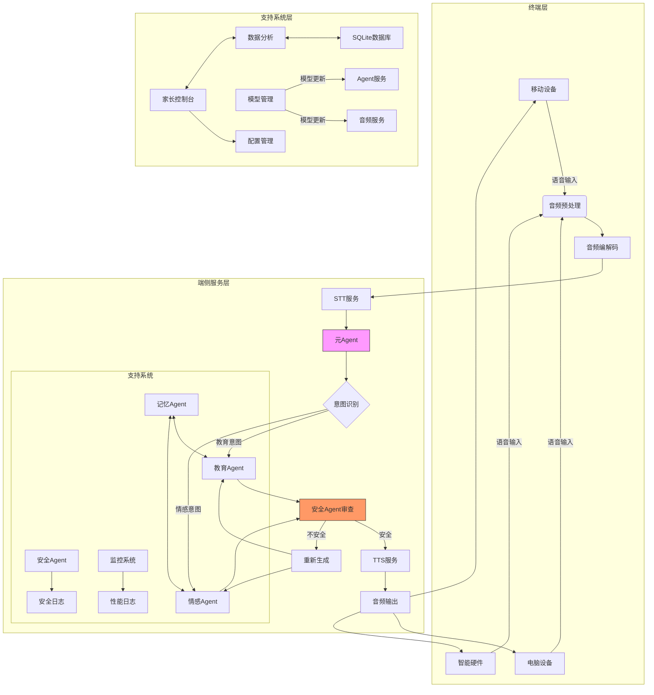
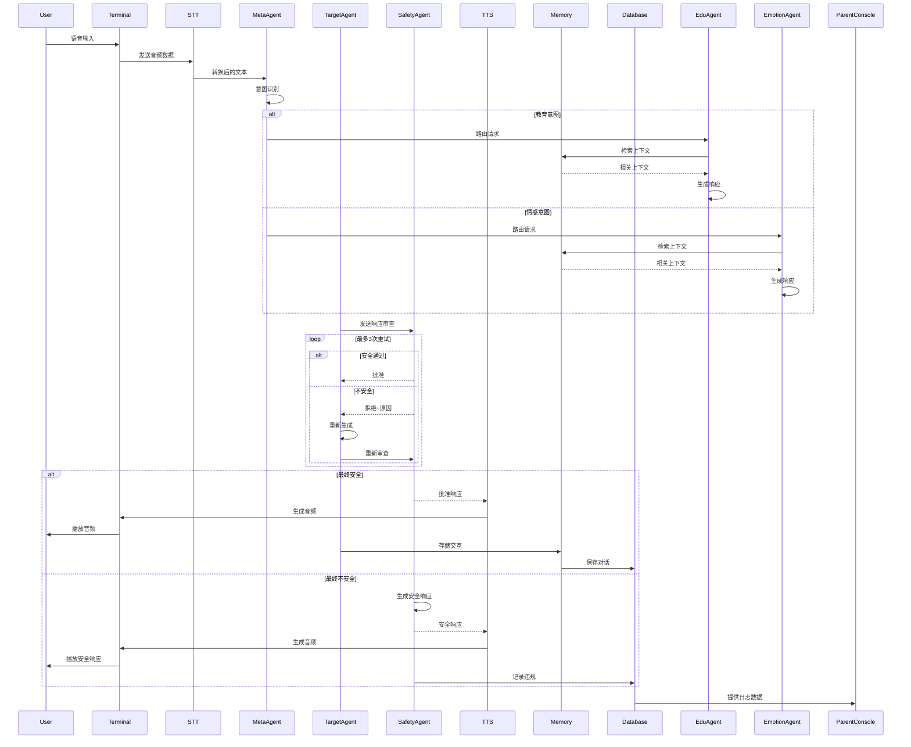

# 儿童教育AI系统架构文档

## 1. 系统概述

儿童教育AI系统是一个专为儿童设计的智能教育助手，采用多Agent架构，提供教育问答、情感陪伴、安全监控等功能。系统遵循儿童保护原则，确保内容安全和隐私保护。

## 2. 系统架构

### 2.1 整体架构图

### 2.2 架构层次

#### 2.2.1 终端层
- 移动设备：智能手机、平板电脑等移动终端
- 电脑设备：PC、笔记本等计算设备
- 智能硬件：智能音箱、教育机器人等IoT设备

#### 2.2.2 端侧服务层
- 音频处理：负责音频的预处理、编解码等
- STT/TTS服务：语音识别和合成服务
- Agent服务：核心业务逻辑处理
- 安全审查：内容安全检查和过滤

#### 2.2.3 支持系统层
- 数据存储：用户数据、对话历史等持久化存储
- 家长控制：家长监控和管理功能
- 模型管理：AI模型的更新和管理
- 系统监控：性能监控和日志分析

## 3. 核心组件

### 3.1 Agent架构

#### 3.1.1 元Agent (MetaAgent)
- 职责：意图识别和请求路由
- 功能：
  - 分析用户输入的意图类型
  - 将请求路由到相应的处理Agent
  - 维护Agent之间的协调

#### 3.1.2 教育Agent (EduAgent)
- 职责：处理教育相关问题
- 功能：
  - 回答学科问题（数学、语文、英语等）
  - 提供学习建议和指导
  - 适应不同年龄段的学习需求

#### 3.1.3 情感Agent (EmotionAgent)
- 职责：提供情感支持和陪伴
- 功能：
  - 识别和响应用户情感状态
  - 提供情感安慰和鼓励
  - 促进儿童心理健康发展

#### 3.1.4 安全Agent (SafetyAgent)
- 职责：内容安全审查
- 功能：
  - 检查内容是否符合儿童保护标准
  - 过滤不当内容
  - 记录安全违规事件

#### 3.1.5 记忆Agent (MemoryAgent)
- 职责：对话历史和用户信息管理
- 功能：
  - 存储和检索对话历史
  - 维护用户个性化信息
  - 支持上下文理解

### 3.2 音频服务

#### 3.2.1 音频预处理 (processing.py)
- 音频归一化
- 静音移除
- 重采样

#### 3.2.2 语音识别 (stt_service.py)
- 语音到文本转换
- 支持多语言识别

#### 3.2.3 语音合成 (tts_service.py)
- 文本到语音转换
- 情感化语音输出

#### 3.2.4 声纹验证 (verification.py)
- 用户身份验证
- 防止未授权使用

#### 3.2.5 音频编解码 (codecs.py)
- 音频格式转换
- 数据压缩和解压缩

### 3.3 数据管理

#### 3.3.1 数据库管理器 (manager.py)
- 数据库连接管理
- 事务处理
- 数据持久化

#### 3.3.2 数据模型 (models.py)
- 用户模型
- 对话模型
- 安全日志模型

#### 3.3.3 数据查询 (queries.py)
- 复杂查询封装
- 统计分析支持

### 3.4 API服务

#### 3.4.1 路由管理 (routes.py)
- RESTful API端点
- 请求处理和响应

#### 3.4.2 数据模型 (schemas.py)
- 请求/响应数据结构定义
- 数据验证

#### 3.4.3 认证授权 (auth.py)
- 用户认证
- 权限控制

#### 3.4.4 WebSocket支持 (websockets.py)
- 实时通信
- 双向数据传输

## 4. 数据流向

### 4.1 用户交互流程

## 5. 安全机制

### 5.1 内容安全
- 多层内容过滤机制
- 关键词黑名单
- 语义分析审查
- 人工审核支持

### 5.2 隐私保护
- 数据最小化收集
- 敏感信息加密存储
- 用户数据访问控制
- 符合儿童隐私保护法规

### 5.3 身份验证
- 声纹识别验证
- 多因素认证
- 会话管理
- 访问日志记录

## 6. 性能优化

### 6.1 缓存策略
- 热点数据缓存
- 对话历史缓存
- 模型推理结果缓存

### 6.2 负载均衡
- Agent负载分发
- 请求队列管理
- 资源监控和自动扩容

### 6.3 数据库优化
- 索引优化
- 查询优化
- 连接池管理

## 7. 部署架构

### 7.1 容器化部署
- Docker镜像打包
- 多容器编排
- 环境配置管理

### 7.2 服务监控
- 实时性能监控
- 错误日志收集
- 告警机制

### 7.3 扩展性设计
- 微服务架构
- 水平扩展支持
- 插件化Agent设计

## 8. 开发规范

### 8.1 代码规范
- PEP8编码规范
- 类型提示
- 文档字符串
- 单元测试覆盖率

### 8.2 版本管理
- Git版本控制
- 分支管理策略
- 发布流程

### 8.3 CI/CD
- 自动化测试
- 持续集成
- 自动部署